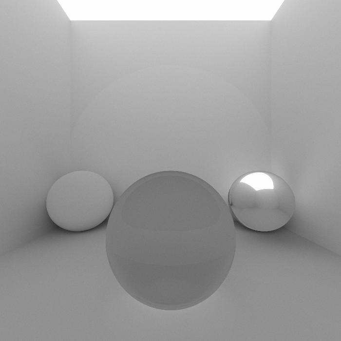

raytracer
=========

A Monte Carlo path tracer.

Samples
-------

Building
--------

    $ cargo build --release

Running
-------

Running the renderer will produce a `test.ppm` image file.

    $ cargo run --release
